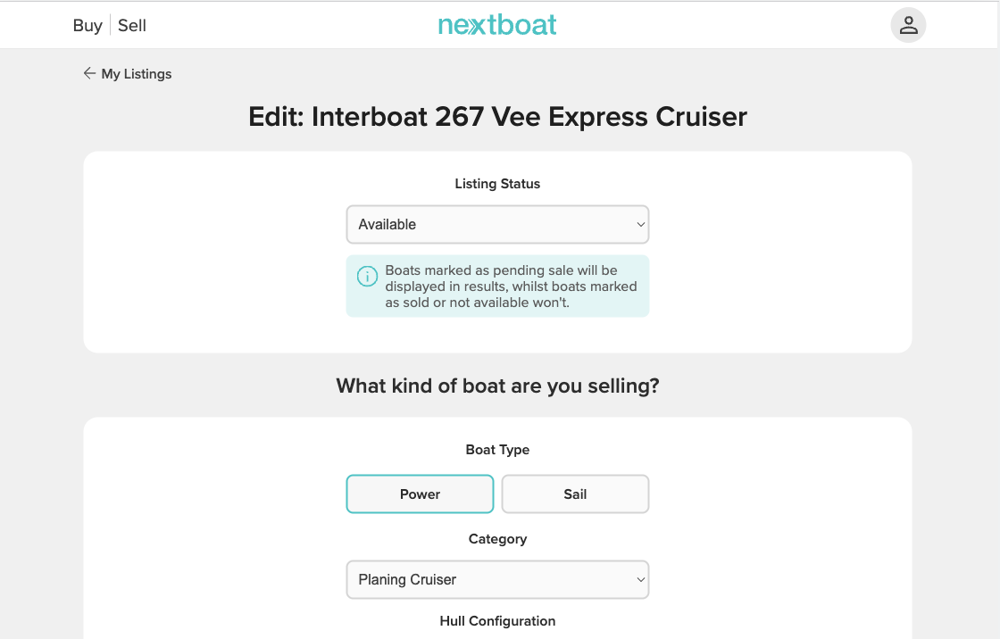
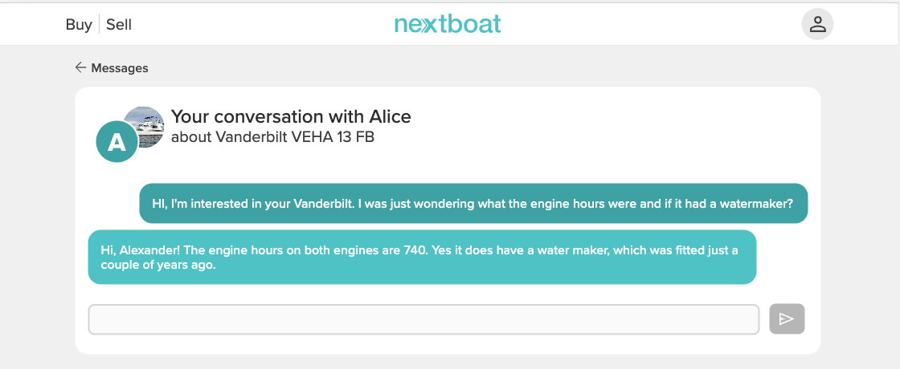

# Next-Boat

NextBoat is a classifieds listing website that connect buyers and sellers of boats. The wbeiste allows seller to create listings and then for potential buyers to browse these listings. The website also includes an in-built messaging app, allowing buyers to contact sellers in a secure way without having to give out personal information.


## Design Process

### UX Design & Agile

- In Agile software development, user stories are used to capture the requirements for a particular feature or piece of work. They are typically written from the perspective of an end user using the format:
    - As a **role** I can **functionality** so that **benefit**

- For this project I used GitHub's built in Projects feature, to organise the Agile devlopment process. A Kanban board was created which featured three columns, Todo, In Progress & Done. 
    - The project Kanban board can be viewed [here](https://github.com/users/ancfoster/projects/2/views/1)

- New User stories were created as Issues and placed in the Todo column. A user story being developed was placed in the 'In Progress' column, whilst completed user stories were placed in the 'Done' column. 

- User stories were labelled, 'must have', 'should have', 'could have'.

### User Stories

**Implemented user stories** | All user stories labelled as 'must have' or 'should have' were completed.

- View Listings
    - As a user I can browse boat listings so that I can see if there is a boat on NextBoat that I am interested in

- View detailed information about a boat
    - As a user I can see a detailed view of a listing so that I can learn as much information about a boat and see a gallery of images of that boat

- Create a listing
    - As a user I can create a boat listing so that I can allow other users to see my boat is for sale and view the boat particulars, price and photos

- Edit Listing
    - As a user I can edit a listing so that I can update listing information and listing images

- Delete Listing
    - As a user I can delete a listing so that I can remove my boat from the site if I no longer wish it to be on there.

- Send a message
     - As a user I can initiate a message chat with a boat owner so that so that I can express interest in a boat on NextBoat and/or ask the owner questions about this boat
     - As a user I can respond to a potential buyer's message so that I can communicate with them

- View Messages
    - As a user I can view sent & received messages so that I can communicate with other NextBoat users and see past messages in a message exchange

- Favourite Listings
    - As a user I can **mark listings as a 'favorite' ** so that I can save boats I like the look of as I browse the site, so that I can then view them another time without having to find them in the listings again.

- Compress Uploaded Image Files
    - As a site owner the site will automatically compress and resize uploaded images so that I can reduce cloud storage and bandwidth costs
    - As a user the site will automatically compress and resize uploaded images so that pages will load quickly, improving the overall user experience.

**User stories not implemented**

These user stories, all labelled as 'could have' were not implemented in this iteration. As part of the agile process they will stay on the Kanban board for the next itertaion and their label will be reviewed as part of the next iteration's planning.

- Filter Listings
    - As a user I can filter listings so that I can only see boat listings that meet my criteria

- Share Boat
    - As a user I can open a share modal so that share a boat listing on popular services like WhatsApp, Facebook and by email

### Visual Design

#### Colours


I've used CSS `:root` variables to easily update the global colour scheme by changing only one value, instead of everywhere in the CSS file.


#### Fonts

I've used CSS `:root` variables to easily update font-weights scheme by changing only one value, instead of everywhere in the CSS file.

The nextboat project makes use of Adobe Fonts.

Only one font (with multiple weights) is used in the project:

- [Proxima Nova](https://fonts.adobe.com/fonts/proxima-nova)


#### Icons

- [Google Font Icons](https://fonts.google.com/icons)

Icons were used throughout the site to improve the user interface.

- e.g My Listings - a trashcan icon is used to represent delete functionality, a pen to represent edit.

- e.g Favourites - on a listing a user can add and remove the listing to their favourites by using a heart icon as a toggle button.

- Icons are also used in the account dropdown menu.

### Wireframes

Wireframes were crated in Figma for desktop and mobile views.

## Features

### Existing Features

| **Feature** | **Description** | **Screenshot** |
|---|---|---|
| Home Page | Explains the purpose of the site to new users. |  |
| Listings | Shows a page consisting of cards of all the boats currently available on the site. |  |
| Listings Detail View | Shows a detailed information. view of a particular boat listing. Also shows an expandable image gallery. |  |
| Navigation Bar | Allows users to quickly navigate between key functionality. |  |
| Profile Menu | This is a drop down menu. When a user isn't logged in it provides links to login and signup pages. WHen a user is logged it it provides full access to all account functionality. |  |
| Creat account | Allows a user to make an account |  |
| Login | A form that allows a user to login |  |
| Create listing | A page showing a form that allows a user to list their own boat for sale.  |  |
| My Listings | A page that shows a user all of the listings they have created. Provides links for editing, editing the associated images and deletion. |  |
| Edit Listing | Displays a form that allows the user to update information about their boat listing. |  |
| Edit Listing Images | This feature allows a user to delete images associated with their listing and upload new ones. |  |
| Delete listing | This feature allows a user to delete a listing. |  |
| Contact seller | On every listing there is a button that allows prospective buyers to contact the seller. When clicked this launches a new message view. |  |
| Messages List | This feature shows a list of conversations a user is having with other users about specific boats.  |  |
| Conversation view | This feature shows messages between two users and allows a user to send additional messages via form. It is styled to look like popular messaging applications like iMessage or Facebook Messenger. |  |
| Favourites List | This feature shows a list of favourite listings that a user has created. A delete icon allows indvidual favourites to be deleted. |  |
| Favourite toggle button | On each listing details page. A logged in user can add a listing to their favourites list or remove it from their favourites list by clicking the heart icon. |   |

### Features for future iterations

- Email integration
    - Email sent upon account creation
    - Password reset emails
    - Notification emails

- The site owners would eventually like to monetise the site. To do the following features need to be implemented.
    - Users will have to pay a small fee to list their boat on the site.
    - Users will be able to pay to boost their boat listing within the listing results.

- The site owners wish to attract businesses like yacht brokers and boat yards. To facilitate this the following features will need to be added:
    - Different account types, personal and business.
    - There will be a business dashboard for business users so that they can get detailed infromation about their listings. e.g Number of listing views
    - Integration with popular CRM solutions.

- To increase site traffic the site owners would also like dynamic integration with Google Ads, so that adverts for listings can be dynamically generated.

- An analytics system to track the listing prices of different kinds of boats over time. 

## Database Schema 

## Technologies & Tools Used

### Front-End

- HTML5 - hypertext markup language is the standard language for designing files to be displayed in a web browser like Chrome or Safari. 

- CSS3 - cascading style sheets is a language used for styling a file written in a markup language like HTML.

- JavaScript (ES11) is a scripting language and one of the main technologies of web development. In this project it was used on the client side for webpage behavior.

### Back-End

- [Django](https://www.djangoproject.com/) an open-source, Python-based web framework that follows the model–template–views (MTV) architectural pattern.

- [PostgreSQL](https://www.postgresql.org/) is an open-source relational database management system (RDBMS)

- [Python](https://www.python.org/) is a high-level, general-purpose programming language and was used for the backend. The use of Django as the selected framework dictated the use of Python.

- [Heroku](https://heroku.com/) is a cloud platform as a service (PaaS) supporting several programming languages and database. Heroku is used to host the deployed application and PostgreSQL database.

- [AWS S3](http://aws.amazon.com/s3/) was used for hosting the Django static files and user uploaded media. Amazon Simple Storage Service is a service offered by Amazon Web Services (AWS) that provides object storage through a web service interface.

### Packages Used

Further details on all Python packages used on this project can be found in the requirements.txt file.
| Package | Version | Description |
|---|---|---|
| asgiref | 3.5.2 | ASGI is a standard for Python asynchronous web apps and servers to communicate with each other, and positioned as an asynchronous successor to WSGI. |
| backports.zoneinfo | 0.2.1 | Backport of the standard library module zoneinfo |
| boto3 | 1.26.12 | Boto3 is the Amazon Web Services (AWS) Software Development Kit (SDK) for Python, which allows Python developers to write software that makes use of services like Amazon S3 and Amazon EC2 |
| botocore | 1.29.12 | A low-level interface to a growing number of Amazon Web Services. The botocore package is the foundation for the AWS CLI  |
| dj-database-url | 1.0.0 | Allows you to utilize the 12factor inspired DATABASE_URL environment variable to configure your Django application. |
| Django | 3.2.16 | Django is a high-level Python web framework that encourages rapid development and clean, pragmatic design. |
| django-allauth | 0.51.0 | Integrated set of Django applications addressing authentication, registration, account management as well as 3rd party (social) account authentication. |
| django-multiupload | 0.6.1 | Simple drop-in multi file upload field for django forms using HTML5's multiple attribute. |
| django-storages | 1.13.1 | Adds support for storage backends in Django |
| gunicorn | 20.1.0 | A Python WSGI HTTP Server for UNIX. |
| jmespath | 1.0.1 | JSON Matching Expressions |
| oauthlib | 3.2.2 | A generic, spec-compliant, thorough implementation of the OAuth request-signing logic |
| Pillow | 9.3.0 | Python Imaging Library adds image processing capabilities |
| psycopg2-binary | 2.9.5 | PostgreSQL database adapter for the Python programming language |
| PyJWT | 2.6.0 | JSON Web Token implementation in Python |
| python3-open-id | 3.2.0 | A set of Python packages to support use of the OpenID decentralized identity system |
| pytz | 2022.7 | Accurate and cross platform timezone calculations |
| requests-oauthlib | 1.3.1 | Provides OAuth library support for requests |
| s3transfer | 0.6.0 | For managing Amazon S3 transfers |
| sqlparse | 0.4.3 | A non-validating SQL parser. |


### Tools Used

- For writing the project code, [GitPod](https://gitpod.io) a cloud based version of Visual Studio code was used,

- [GitHub](https://github.com]) was used for hosting the online repository, it provides an online version of Git, a source code management tool. 

- [GitHub](https://github.com) was also used as the agile project management tool. GitHub contains a Projects feature that allows for the creation of Kanban boards.

- Adobe Illustrator was used to site graphics. 

- [Git](https://git-scm.com) used for version control. (`git add`, `git commit`, `git push`)

- [Figma](https://figma.com) was used to create wirefames, UX prototypes and mockups.

## Testing

- For all testing, please refer to the [TESTING.md](TESTING.md) file.

## Deployment

The live deployed application can be found deployed on [Heroku](https://nextboat-ci.herokuapp.com).


### Heroku Deployment

This project uses [Heroku](https://www.heroku.com), a platform as a service (PaaS) that enables developers to build, run, and operate applications entirely in the cloud.

Deployment steps are as follows, after account setup:

- Select **New** in the top-right corner of your Heroku Dashboard, and select **Create new app** from the dropdown menu.
- Your app name must be unique, and then choose a region closest to you (EU or USA), and finally, select **Create App**.
- From the new app **Settings**, click **Reveal Config Vars**, and set your environment variables.

| Key | Value |
| --- | --- |
| `AWS_ACCESS_KEY_ID` | insert your own AWS Access Key ID key here |
| `AWS_SECRET_ACCESS_KEY` | insert your own AWS Secret Access key here |
| `DATABASE_URL` | Insert Heroku database url here (setting up Heroku database is in next step) |
| `SECRET_KEY` | this can be any random secret key |

Heroku needs two additional files in order to deploy properly.
- requirements.txt
- Procfile

You can install this project's **requirements** (where applicable) using:
- `pip3 install -r requirements.txt`

If you have your own packages that have been installed, then the requirements file needs updated using:
- `pip3 freeze --local > requirements.txt`

The **Procfile** can be created with the following command:
- `echo web: gunicorn app_name.wsgi > Procfile`
- *replace **app_name** with the name of your primary Django app name; the folder where settings.py is located*

For Heroku deployment, follow these steps to connect your own GitHub repository to the newly created app:

Either:
- Select **Automatic Deployment** from the Heroku app.

Or:
- In the Terminal/CLI, connect to Heroku using this command: `heroku login -i`
- Set the remote for Heroku: `heroku git:remote -a app_name` (replace *app_name* with your app name)
- After performing the standard Git `add`, `commit`, and `push` to GitHub, you can now type:
	- `git push heroku main`

### PostgreSQL database

This project uses a Heroku PostgreSQL Databse.

- Visit Heroku dashboard
- Under project dashboard, go to the Resources tab.
- Click on add ons.
- Under Data Stores, select Heroku Postgres.
- You will then be asked to pick a plan. The Mini plan is fine for development and light usage purposes. A detailed guide on the differences between the plans is available on the Heorku site.
- Then search for the Heroku app in the 'App to provison to' box.
- Select 'nextboat-ci'.
- Heroku will then provision the database.
- As part of the provisioning process, a DATABASE_URL config var is added to your app’s configuration. DATABASE_URL contains the URL your app uses to access the database.
- Go back to the resources tab and you will see the Postgres database.
- Add the databse url to the `env.py` file.

| `DATABASE_URL` | Insert Heroku database url here |

### AWS S3 configuration steps

#### S3 Bucket

- Search for **S3**.
- Create a new bucket, give it a name (matching your Heroku app name), and choose the region closest to you.
- Uncheck **Block all public access**, and acknowledge that the bucket will be public (required for it to work on Heroku).
- From **Object Ownership**, make sure to have **ACLs enabled**, and **Bucket owner preferred** selected.
- From the **Properties** tab, turn on static website hosting, and type `index.html` and `error.html` in their respective fields, then click **Save**.
- From the **Permissions** tab, paste in the following CORS configuration:

	```shell
	[
		{
			"AllowedHeaders": [
				"Authorization"
			],
			"AllowedMethods": [
				"GET"
			],
			"AllowedOrigins": [
				"*"
			],
			"ExposeHeaders": []
		}
	]
	```

- Copy your **ARN** string.
- From the **Bucket Policy** tab, select the **Policy Generator** link, and use the following steps:
	- Policy Type: **S3 Bucket Policy**
	- Effect: **Allow**
	- Principal: `*`
	- Actions: **GetObject**
	- Amazon Resource Name (ARN): **paste-your-ARN-here**
	- Click **Add Statement**
	- Click **Generate Policy**
	- Copy the entire Policy, and paste it into the **Bucket Policy Editor**

		```shell
		{
			"Id": "Policy1234567890",
			"Version": "2012-10-17",
			"Statement": [
				{
					"Sid": "Stmt1234567890",
					"Action": [
						"s3:GetObject"
					],
					"Effect": "Allow",
					"Resource": "arn:aws:s3:::your-bucket-name/*"
					"Principal": "*",
				}
			]
		}
		```

	- Before you click "Save", add `/*` to the end of the Resource key in the Bucket Policy Editor (like above).
	- Click **Save**.
- From the **Access Control List (ACL)** section, click "Edit" and enable **List** for **Everyone (public access)**, and accept the warning box.
	- If the edit button is disabled, you need to change the **Object Ownership** section above to **ACLs enabled** (mentioned above).

#### IAM

Back on the AWS Services Menu, search for and open **IAM** (Identity and Access Management).
Once on the IAM page, follow these steps:

- From **User Groups**, click **Create New Group**.
	- Suggested Name: `group-Next-Boat-LOWER` (group + the project name)
- Tags are optional, but you must click it to get to the **review policy** page.
- From **User Groups**, select your newly created group, and go to the **Permissions** tab.
- Open the **Add Permissions** dropdown, and click **Attach Policies**.
- Select the policy, then click **Add Permissions** at the bottom when finished.
- From the **JSON** tab, select the **Import Managed Policy** link.
	- Search for **S3**, select the `AmazonS3FullAccess` policy, and then **Import**.
	- You'll need your ARN from the S3 Bucket copied again, which is pasted into "Resources" key on the Policy.

		```shell
		{
			"Version": "2012-10-17",
			"Statement": [
				{
					"Effect": "Allow",
					"Action": "s3:*",
					"Resource": [
						"arn:aws:s3:::your-bucket-name",
						"arn:aws:s3:::your-bucket-name/*"
					]
				}
			]
		}
		```
	
	- Click **Review Policy**.
	- Suggested Name: `policy-Next-Boat-LOWER` (policy + the project name)
	- Provide a description:
		- "Access to S3 Bucket for Next-Boat-LOWER static files."
	- Click **Create Policy**.
- From **User Groups**, click your "group-Next-Boat-LOWER".
- Click **Attach Policy**.
- Search for the policy you've just created ("policy-Next-Boat-LOWER") and select it, then **Attach Policy**.
- From **User Groups**, click **Add User**.
	- Suggested Name: `user-Next-Boat-LOWER` (user + the project name)
- For "Select AWS Access Type", select **Programmatic Access**.
- Select the group to add your new user to: `group-Next-Boat-LOWER`
- Tags are optional, but you must click it to get to the **review user** page.
- Click **Create User** once done.
- You should see a button to **Download .csv**, so click it to save a copy on your system.
	- **IMPORTANT**: once you pass this page, you cannot come back to download it again, so do it immediately!
	- This contains the user's **Access key ID** and **Secret access key**.
	- `AWS_ACCESS_KEY_ID` = **Access key ID**
	- `AWS_SECRET_ACCESS_KEY` = **Secret access key**

#### Final AWS Setup

- If Heroku Config Vars has `DISABLE_COLLECTSTATIC` still, this can be removed now, so that AWS will handle the static files.
- Back within **S3**, create a new folder called: `media`.
- Select any existing media images for your project to prepare them for being uploaded into the new folder.
- Under **Manage Public Permissions**, select **Grant public read access to this object(s)**.
- No further settings are required, so click **Upload**.

### Local deployment

In order to make a local copy of this project, you can clone it. In your IDE Terminal, type the following command to clone my repository:

`git clone https://github.com/ancfoster/Next-Boat.git`

Alternatively, if using Gitpod, you can click below to create your own workspace using this repository.

[](https://gitpod.io/#https://github.com/ancfoster/Next-Boat)


## Credits

### Technical documentation and tutorials

- I followed a tutorial created by [Michael Herman](https://testdriven.io/blog/storing-django-static-and-media-files-on-amazon-s3/) on how to configure a Django application to store static and media files on AWS S3.

- Extensive use was made of the [Django project documentation](https://docs.djangoproject.com/en/4.1/)

- 

- Code snippet from Stackoverflow user [artem](https://stackoverflow.com/questions/8317537/django-templates-split-string-to-array) to convert a string into an array with a custom Django template filter

- [Code snippet](https://stackoverflow.com/questions/48248405/cannot-write-mode-rgba-as-jpeg) from Stackoverflow user [Prahlad Yeri](https://stackoverflow.com/users/849365/prahlad-yeri) Using PILLOW to convert an uploaded image if it is a PNG with alpha channel, which would otherwise cause an error when converting the upload file to .JPG format. 

### Acknowledgements
I would like to thank my Code Institute mentor Tim Nelson for providing invaluable guidance duirng the development of this project. I would also like to thank my wife for testing NextBoat and adding lots of boat listings. 