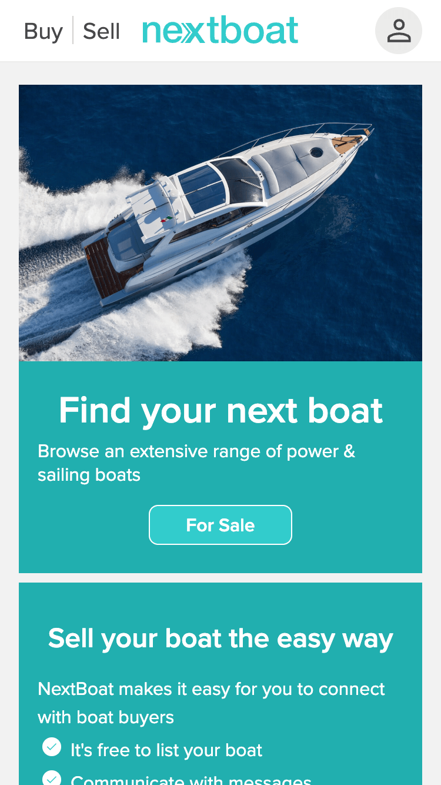
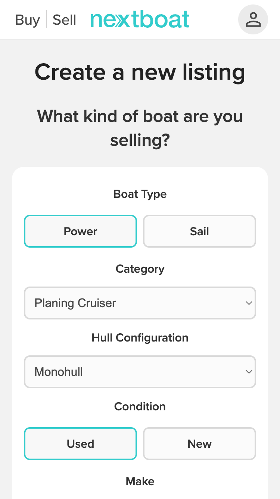
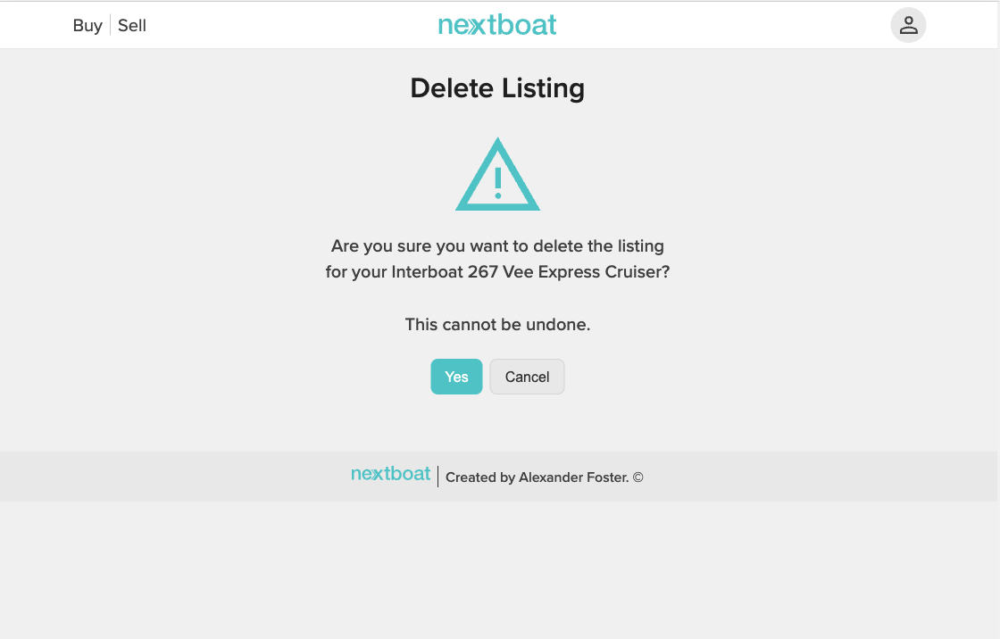
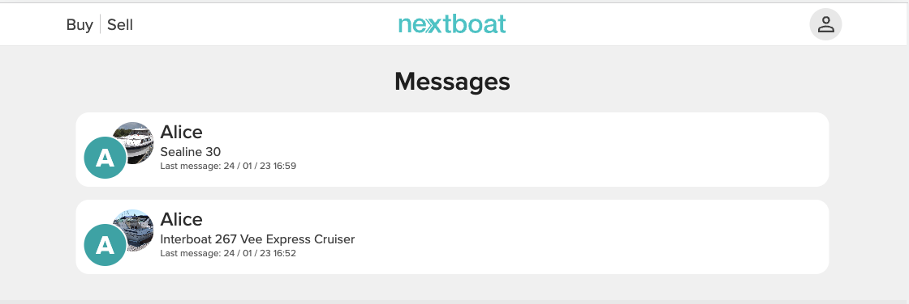

# Testing
 Click to return back to [README.md](README.md)

## Code Validation

### Javascript JSHint 
All JavaScript code was analysed with [JSHint](https://jshint.com)

| File | Screenshot |
|---|---|
|base.js||
|edit_listing.js||
|create.js||
|gallery.js||
|message.js||

### CSS Validation

CSS files were validated with the [W3C CSS Validation Service](https://jigsaw.w3.org/)

| File | Screenshot |
|---|---|
| account.css |  |
| base.css |  |
| conversarion.css |  |
| create.css |  |
| delete_listing.css |  |
| edit_delete_images.css |  |
| favourites.css |  |
| home.css |  |
| listing_details.css |  |
| listings.css |  |
| messages.css |  |
| my_listings.css |  |

### PEP8 Python Validation

- Listings App

|File|Screenshot|
|---|---|
|admin.py||
|models.py||
|urls.py||
|views.py||
|forms.py||

- Conversations

|File|Screenshot|
|---|---|
|admin.py||
|models.py||
|urls.py||
|views.py||
|forms.py||

- Favourites App

|File|Screenshot|
|---|---|
|admin.py||
|models.py||
|urls.py||
|views.py||

### HTML Validation

As many pages require a user to be logged in validation was carried out by copying the source code from the browser and pasting it into the W3 Nu HTML Validator.

Django forms generated HTML that did not pass validation in `create_listing_form.html` and `listing_edit.html`, the `required` attribute is not allowed on element `input`. As Django generated this I am unable to fix it.

All other HTML validation tests were successful. 

|File|Screenshot|
|---|---|
|index.html||
|favourites.html||
|favourites_delete.html||
|conversations.html||
|display_conversations.html||
|listings.html||
|listing_delete.html||
|listing_edit_images.html||
|my_listings.html||
|listing_create_form.html||
|listing_edit.html||

## Browser Compatibility Testing

Pages were tested in Chrome & Firefox to test for compatiblity between different browsers.
Chrome and Firefox use different rendering engines, unlike Edge/Brave which also use Chromium.

- conversations.html

| Browser| Screenshot |
|---|---|
|||
|||

- display_conversations.html

| Browser| Screenshot |
|---|---|
|||
|||

- favourites.html

| Browser| Screenshot |
|---|---|
|||
|||

- index.html

| Browser| Screenshot |
|---|---|
|||
|||

- listing_details.html

| Browser| Screenshot |
|---|---|
|||
|||

- listing_edit.html

| Browser| Screenshot |
|---|---|
|||
|||

- listings.html

| Browser| Screenshot |
|---|---|
|||
|||

- my_listings.html

| Browser| Screenshot |
|---|---|
|||
|||

## Responsiveness

| **Feature** | **iPhone** | **Desktop** |
|---|---|---|
| Home Page |  |  |
| Listings | |  |
| Listings Detail View |  |  |
| Create listing |   |  |
| My Listings |  |
| Delete listing |  |  |
| Messages List |   |  |
| Favourites List |  |  |

## Manual Testing

## Automted Testing

Using the built in Django library unittest I wrote a number series of unit tests to test the operation of key functions and classes.