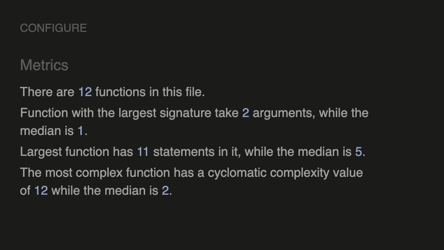
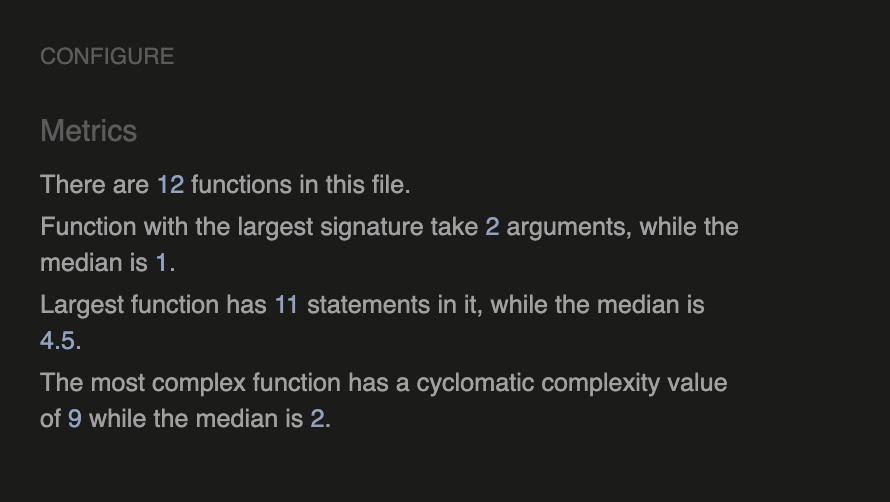
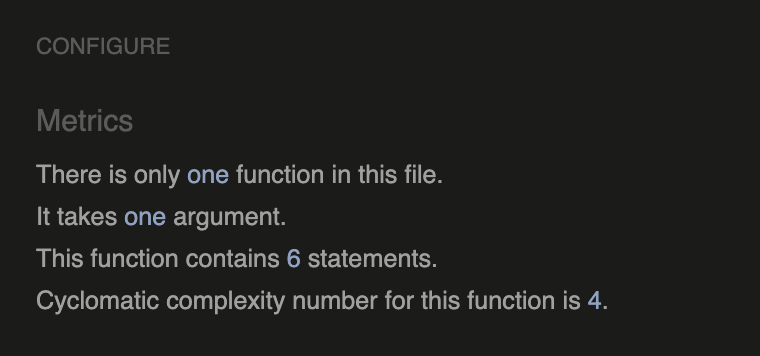

# Testing
 Click to return back to [README.md](README.md)

## Code Validation

### Javascript JSHint 
All JavaScript code was analysed with [JSHint](https://jshint.com)

| File | Screenshot |
|---|---|
|base.js||
|edit_listing.js||
|create.js||
|gallery.js||
|message.js||

### HTML Vlidation

### CSS Validation

## Browser Compatibility Testing

## Responsiveness

## Manual Testing

